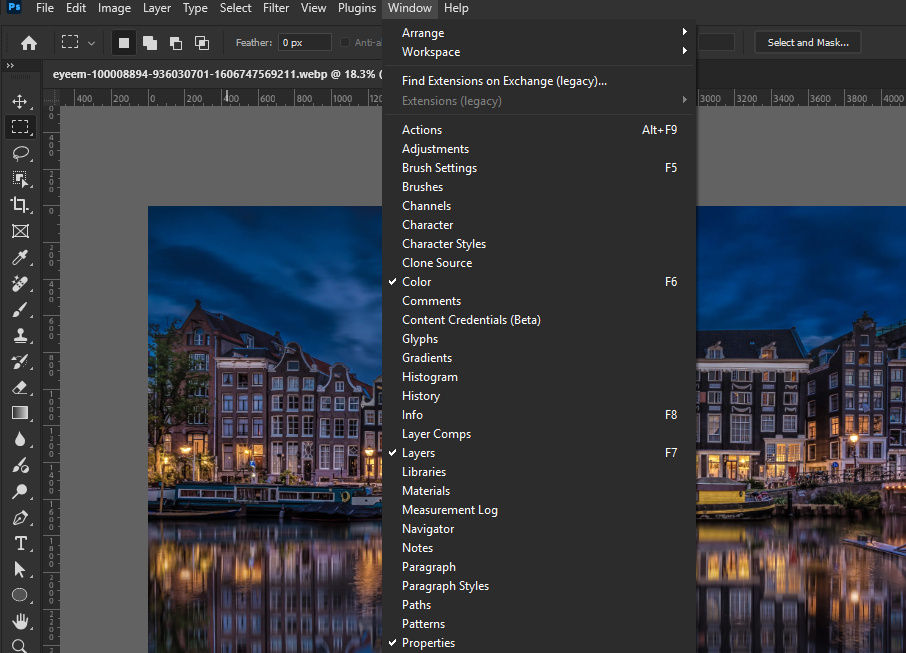
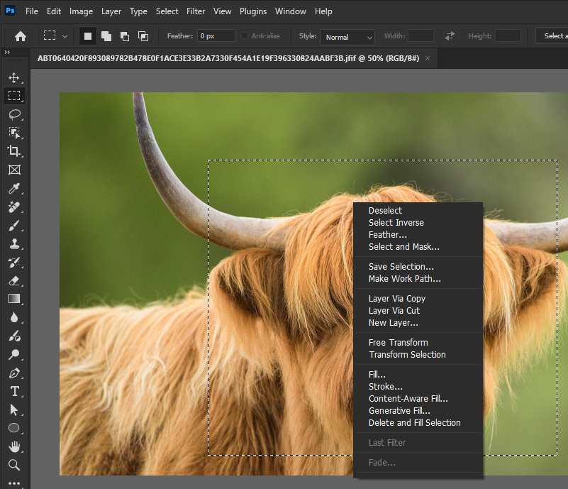

# Photoshop Dark Menus

Enables dark mode and custom separator colors for all menus (top bar dropdowns and context menus) in Adobe Photoshop.

This mod dynamically updates the active Windows session palette and intercepts GDI line drawing calls to force dark menu styling without making permanent modifications to registry keys on disk.

## Features
- **Full Dark Mode**: Applies dark backgrounds and customizable text colors to all Photoshop menus.
- **Custom Separators**: Fine-tune or hide separator lines independently from disabled item text.
- **Clean Text Rendering**: Maintains legible contrast for both enabled and disabled menu items.
- **Non-Destructive**: Automatically restores default Windows system colors upon exiting Photoshop.

## Screenshots

## Options
The following settings can be customized in the Windhawk mod panel:
- **Menu Background Color**: Background color for all menu popups (Default: `#282828`).
- **Menu Text Color**: Text color for active items (Default: `#DCDCDC`).
- **Highlight Background Color**: Color when hovering over an item (Default: `#505050`).
- **Separator Line Color**: Color for separator lines. Set to match the background color to hide them completely (Default: `#383838`).
- **Disabled Text Color**: Text color for disabled menu items (Default: `#808080`).
